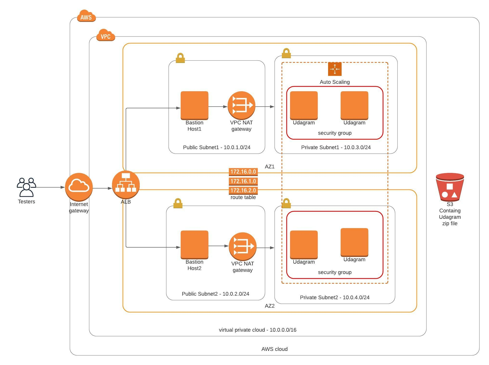

# Deploy a high availability web app using CloudFormation

This project is one of **Udacity Cloud DevOps Nanodegree**.\
The goal is to deploy a high availability web app called Udagram through provisioning infrastructure as a code (IAC) using CloudFormation.

## Udagram Infrastructure Diagram

## Notes

- I recommend using cfn-lint to validate your CloudFormation templates. I liked this tool, which saves a lot of time. you can read more about it through this link (<https://github.com/aws-cloudformation/cfn-python-lint>)

- To avoid charging myself too much cost, I had to delete the storage bucket, so if you are having a real-world scenario close to the Udagram app, please remember to change the storage bucket to your storage bucket name.

- Even I included a bastion host in my diagram, but I didn't implement it to act as a jumpbox in my templates. Maybe this will be my feature work in this repo.

## How to run

You have a 3 scripts here:-\
`create.sh` to create a cloudformation stack in a scripting aws instead of writing a long AWS command, use it with the network-components.yml file.\
`create-servers-stack.sh` the difference between this script and the above one, this script has `--capabilities CAPABILITY_IAM` option, which is required when you are creating a stack that includes IAM role resources, so use it with the udagram-server.yml file.\

`create.sh` to update your cloudformation stack.
